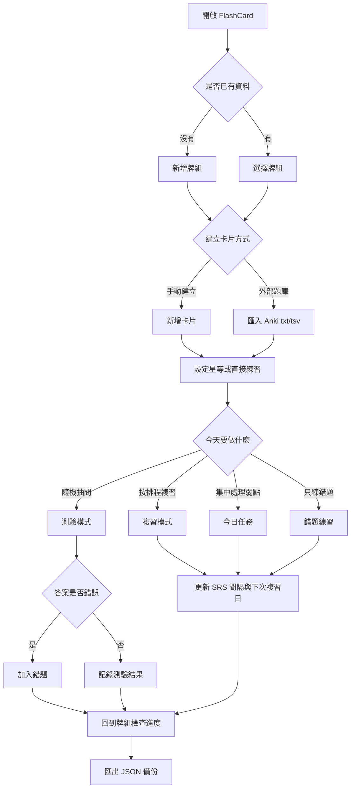
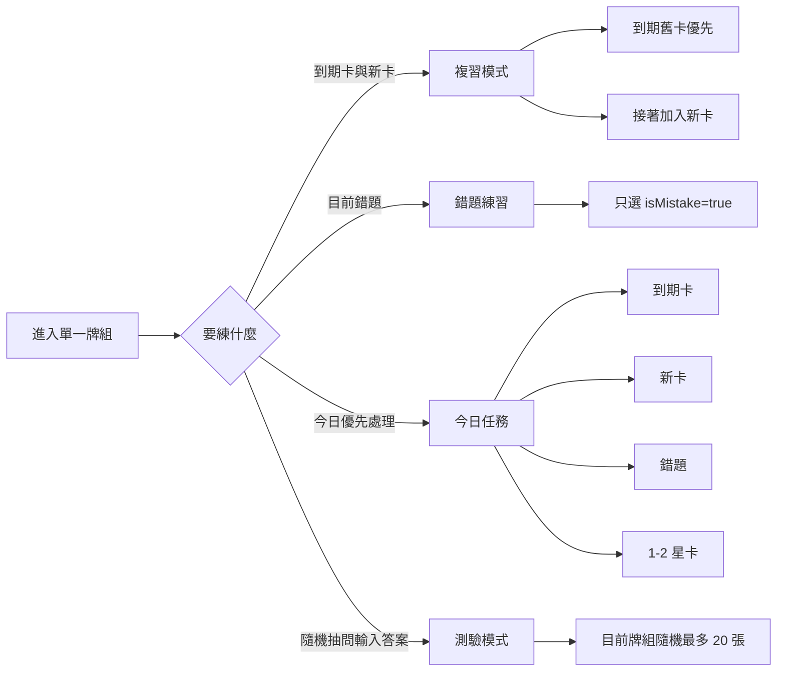
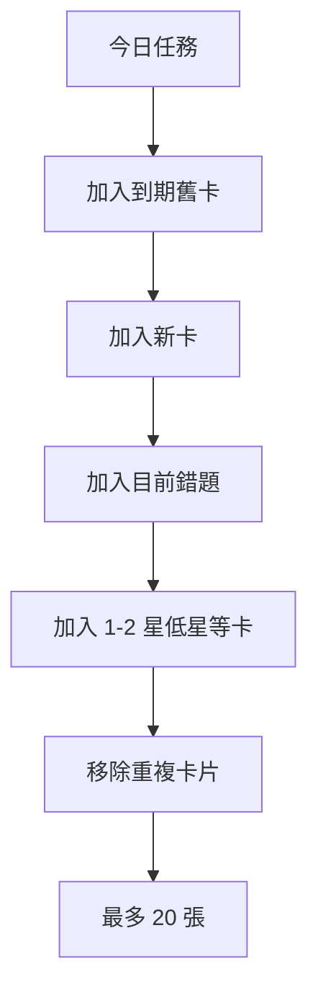
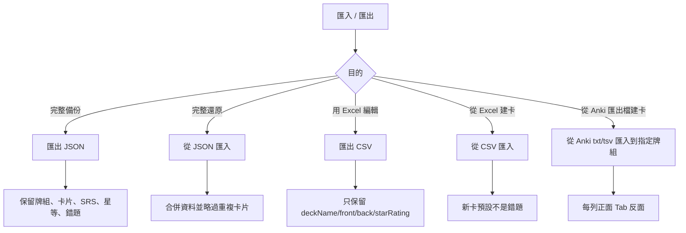
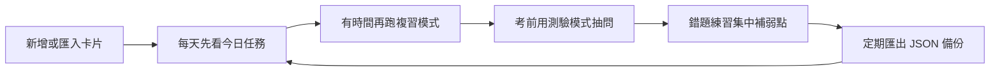

# 快閃卡 FlashCard 使用者操作手冊

快閃卡 FlashCard 是一套桌面版記憶卡工具，用來建立題庫、整理考試重點、背單字、練習問答題，並透過複習、錯題、今日任務與測驗模式追蹤學習狀態。

本手冊面向一般使用者，說明從建立第一個牌組到備份資料的完整操作流程。

## 目錄

- [快速開始](#快速開始)
- [整體使用流程](#整體使用流程)
- [畫面與功能入口](#畫面與功能入口)
- [建立與管理牌組](#建立與管理牌組)
- [新增與編輯卡片](#新增與編輯卡片)
- [卡片預覽與星等](#卡片預覽與星等)
- [學習模式選擇](#學習模式選擇)
- [複習模式](#複習模式)
- [錯題練習](#錯題練習)
- [今日任務](#今日任務)
- [測驗模式](#測驗模式)
- [匯入與匯出](#匯入與匯出)
  - [匯入文字編碼](#匯入文字編碼)
  - [Anki 文字檔格式](#anki-文字檔格式)
- [備份建議](#備份建議)
- [常見問題](#常見問題)
- [開發與建置](#開發與建置)

## 快速開始

1. 開啟 FlashCard。
2. 在左側或主畫面新增牌組。
3. 進入牌組後新增卡片。
4. 每張卡片填寫正面題目與反面答案。
5. 若已有 Anki 匯出的 `.txt` 或 `.tsv` 字卡檔，可到「匯入 / 匯出」匯入到指定牌組。
6. 使用「複習模式」、「今日任務」或「測驗模式」開始練習。
7. 定期到「匯入 / 匯出」匯出 JSON 完整備份。

## 整體使用流程



## 畫面與功能入口

FlashCard 主要分成兩個區域：

- 左側側邊欄：切換牌組、新增牌組、刪除牌組、進入匯入匯出。
- 右側主畫面：顯示牌組列表、單一牌組、卡片預覽、複習、測驗與匯入匯出頁面。

主畫面的統計資訊包含：

- 牌組數與總卡片數。
- 待複習卡片。
- 新卡。
- 錯題。
- 單一牌組內的已學進度與建議加強數。

## 建立與管理牌組

### 新增牌組

1. 點選「新增牌組」。
2. 輸入牌組名稱，例如 `英文單字`、`國考法規`、`期末考重點`。
3. 可選填描述。
4. 按下新增後，牌組會出現在側邊欄與牌組列表。

### 進入牌組

點選牌組名稱即可進入單一牌組頁。單一牌組頁會顯示：

- 卡片總數。
- 已學數。
- 待複習數。
- 新卡數。
- 錯題數。
- 建議加強數。

### 刪除牌組

刪除牌組會連同牌組內卡片一起移除。大量整理前，建議先匯出 JSON 備份。

## 新增與編輯卡片

### 新增卡片

1. 進入牌組。
2. 點選「新增卡片」。
3. 在正面輸入題目。
4. 在反面輸入答案。
5. 檢查預覽內容。
6. 儲存卡片。

### 編輯卡片

1. 在牌組卡片列表找到要修改的卡片。
2. 點選編輯。
3. 修改正面或反面內容。
4. 儲存。

### 刪除卡片

在卡片列表點選刪除即可移除卡片。刪除後不會自動復原，操作前建議先備份。

## 卡片內容格式

卡片內容支援 Markdown。常用格式如下：

```markdown
# 標題
## 小標題

**粗體重點**

- 條列重點
- 第二個重點

`關鍵字`
```

建議正面放短題目，反面放答案、解釋與補充說明。

## 插入圖片

卡片正面與反面都可加入圖片，適合公式、截圖、圖表、手寫筆記與流程圖。

可用方式：

- 點選插入圖片按鈕。
- 直接貼上剪貼簿圖片。
- 從檔案總管拖放圖片。

支援格式包含 PNG、JPG、JPEG、GIF、WEBP、BMP、SVG。

## 卡片預覽與星等

點選卡片可進入預覽頁：

- 點卡片可翻面。
- 可設定 1 到 5 星。
- 若卡片是錯題，會顯示錯題標記、累計錯誤次數與最近錯誤日期。
- 可手動解除錯題。

星等是手動標註，用來幫助你判斷熟悉度。1 到 2 星會被列入「建議加強」與「今日任務」。

## 學習模式選擇



## 複習模式

複習模式適合每天按排程複習。

選卡規則：

- 先選已學且到期的卡片。
- 到期條件是下次複習日小於或等於今天。
- 再加入新卡。
- 不會加入尚未到期的已學卡。

操作方式：

1. 進入牌組。
2. 點選「複習模式」。
3. 先看正面。
4. 點卡片或按空白鍵翻到反面。
5. 依照熟悉度選擇評分。

評分選項：

- 重來 `[1]`：忘記了，卡片會加入錯題。
- 困難 `[2]`：勉強想起來。
- 良好 `[3]`：正常記得。
- 簡單 `[4]`：很熟。

系統會依評分更新複習間隔與下次複習日。複習間隔目前最高限制為 365 天，避免產生多年後才複習的異常日期。

## 錯題練習

錯題練習適合集中處理目前仍標記為錯題的卡片。

選卡規則：

- 只選目前牌組中 `isMistake=true` 的卡片。
- 最近錯的卡片排前面。
- 如果最近錯誤日期相同，錯誤次數多的排前面。

答錯來源：

- 測驗模式答錯。
- 複習模式按「重來」。

解除錯題：

- 可在卡片列表或卡片預覽頁按「解除錯題」。
- 解除後不再出現在錯題練習。
- 歷史錯誤次數仍會保留。

## 今日任務

今日任務是混合式練習清單，適合每天優先處理最需要看的卡片。



選卡優先順序：

1. 到期舊卡。
2. 新卡。
3. 目前錯題。
4. 1 到 2 星卡。

今日任務不是單純依照間隔天數篩選。即使某張卡片尚未到期，只要它是錯題或低星等，也可能出現在今日任務中。

## 測驗模式

測驗模式適合短答案題、單字、日期、公式結果與專有名詞。

選卡規則：

- 從目前牌組所有卡片中隨機挑選。
- 最多 20 張。
- 不看下次複習日。
- 不看間隔天數。
- 不看是否錯題。
- 不看星等。

操作方式：

1. 進入牌組。
2. 點選「測驗模式」。
3. 看題目後輸入答案。
4. 提交答案。
5. 檢查答對或答錯。
6. 繼續下一題直到完成。

判定方式：

- 會忽略前後空白。
- 英文大小寫視為相同。
- 不會判斷同義詞。
- 答案包含 Markdown、圖片或長段落時，建議改用複習模式。

測驗答錯時，該卡片會被加入錯題。

## 匯入與匯出

匯入與匯出支援三種常用情境：JSON 用於完整備份，CSV 用於 Excel 或 Google Sheets 整理，Anki 文字檔則用於把既有 Anki 題庫轉成 FlashCard 牌組內的卡片。



### JSON 完整備份

JSON 會保留完整學習狀態：

- 牌組。
- 卡片內容。
- SRS 複習進度。
- 星等。
- 錯題狀態。
- 錯誤次數。
- 最近錯誤日期。

建議用 JSON 做日常備份與換電腦搬移。

### CSV Excel 相容格式

CSV 適合用 Excel 或 Google Sheets 編輯卡片內容。

欄位格式：

```csv
deckName,front,back,starRating
英文單字,apple,蘋果,3
英文單字,book,書,0
```

注意事項：

- `deckName` 可省略，省略時預設為 `Default`。
- `starRating` 可省略，省略時預設為 0。
- CSV 不包含錯題狀態。
- CSV 不包含 SRS 複習間隔與下次複習日。

### 匯入文字編碼

JSON、CSV 與 Anki 文字檔匯入支援以下文字編碼：

- UTF-8。
- UTF-8 with BOM。
- UTF-16 LE with BOM。
- UTF-16 BE with BOM。
- Big5 / CP950。

若從繁體中文 Windows、Excel 或舊版 Anki 匯出的檔案出現亂碼，請直接使用匯入功能讀取原始檔案，不需要先手動轉碼。

### Anki 文字檔格式

Anki 可匯出純文字檔，常見格式是一列一張卡片，正面與反面用 Tab 分隔。

範例：

```text
問題一	答案一
問題二	答案二
```

匯入方式：

1. 先建立或確認目標牌組。
2. 到「匯入 / 匯出」。
3. 在「Anki 文字檔」區塊選擇要匯入的牌組。
4. 點選「從 Anki txt/tsv 匯入到指定牌組」。
5. 選擇 `.txt` 或 `.tsv` 檔案。

注意事項：

- 只讀取每列前兩欄，第一欄為正面，第二欄為反面。
- 空白列會被忽略。
- 不足兩欄、正面空白或反面空白的列會被略過。
- 同一牌組內正反面都相同的卡片會被視為重複並略過。
- Anki 文字檔不包含 SRS、星等、錯題狀態或圖片媒體。

## 備份建議

建議備份時機：

- 大量新增卡片後。
- 大量修改或刪除前。
- 匯入外部資料前。
- 考試前整理完題庫後。
- 換電腦前。

建議做法：

1. 到「匯入 / 匯出」。
2. 點選「匯出為 JSON」。
3. 將 JSON 檔存到雲端硬碟或外接硬碟。
4. 需要還原時，使用「從 JSON 匯入」。

## 常見問題

### 為什麼複習模式沒有卡片？

可能原因：

- 牌組沒有卡片。
- 已學卡片尚未到期。
- 沒有新卡。

如果想練所有卡片，可以使用測驗模式。

### 為什麼今日任務出現尚未到期的卡片？

今日任務會加入錯題與 1 到 2 星低星等卡，不只看下次複習日。

### 為什麼測驗模式顯示全部卡片？

測驗模式會從目前牌組所有卡片隨機抽題。牌組少於 20 張時，就會全部出現。

### 為什麼解除錯題後還有歷史錯誤次數？

解除錯題只移除目前錯題狀態，不會清空歷史錯誤次數。這樣可以保留卡片曾經答錯的紀錄。

### 什麼是建議加強？

符合以下任一條件就會列入建議加強：

- 目前是錯題。
- 曾經答錯過。
- 星等是 1 或 2 星。

### 刪除牌組或卡片可以復原嗎？

程式內沒有復原功能。刪除前請先匯出 JSON 備份。

## 建議日常使用方式



建議習慣：

- 每天先做今日任務。
- 新卡保持小量新增，不要一次塞太多。
- 答錯後不用急著清除錯題，先用錯題練習確認真的熟了。
- 考前用測驗模式快速檢查短答案。
- 大量整理資料前先備份 JSON。

## 開發與建置

一般使用者不需要閱讀本節。以下提供給需要從原始碼啟動或打包的人。

### 需求

- Node.js LTS。
- npm。
- Rust toolchain。
- Windows 打包 Tauri 需要 Microsoft C++ Build Tools。

### 安裝依賴

```bash
npm install
```

### 啟動前端開發模式

```bash
npm run dev
```

### 啟動桌面開發模式

```bash
npm run tauri:dev
```

Windows 也可使用：

```bat
dev.bat
```

### 建置前端

```bash
npm run build
```

### 打包桌面程式

```bash
npm run tauri:build
```

Windows 也可使用：

```bat
build.bat
```

### 驗證命令

```bash
npm test
npm run lint
npm run build
```

調整 Tauri 後端時，建議加跑：

```bash
cd src-tauri
cargo check
```
